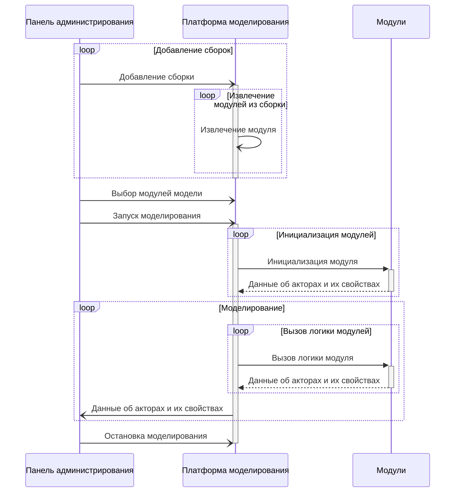

```puml
skinparam monochrome true
skinparam shadowing false
left to right direction

Пользователь --> (Принятие решения на основе моделирования)
(Принятие решения на основе моделирования) ..> (Просмотр свойств модели и акторов) : <<include>>
(Просмотр графических отчетов на основе свойств) ..> (Просмотр свойств модели и акторов) : <<extend>>

(Конфигурирование модели) ..> (Принятие решения на основе моделирования) : <<extend>>
(Конфигурирование модели) ..> (Добавление сборок) : <<include>>
(Конфигурирование модели) ..> (Выбор модулей, участвующих в моделировании) : <<include>>
(Конфигурирование модели) ..> (Управление жизненным циклом моделирования) : <<include>>
(Конфигурирование модели) ..> (Изменение свойст модели и акторов) : <<include>>
```

```puml
skinparam monochrome true
skinparam shadowing false
left to right direction

:Разработчик программной модели: --> (Тестирование разрабатываемой модели)
(Тестирование разрабатываемой модели) ..> (Просмотр логов) : <<include>>

(Конфигурирование модели) ..> (Тестирование разрабатываемой модели) : <<extend>>
(Конфигурирование модели) ..> (Добавление сборок) : <<include>>
(Конфигурирование модели) ..> (Выбор модулей, участвующих в моделировании) : <<include>>
(Конфигурирование модели) ..> (Управление жизненным циклом моделирования) : <<include>>
(Конфигурирование модели) ..> (Изменение свойст модели и акторов) : <<include>>
```

```puml
digraph protodot {

	/* package:   map */
	/* source:    map.proto */
	/* selection:  */

	rankdir=LR;
	label="map";
	tooltip="map";
	bgcolor="transparent"

	node [
		shape=plaintext
		fontsize=10
		fontname="Ubuntu"
	];


	/* ------ nodes ------ */

	/* ------ leaving the root package unwrapped ------ */
	
	
	
	Node_Ja_110	[shape=plaintext tooltip="map.MapFeaturesMetadata.ObservablePropertyMetadata" label=<<TABLE BORDER="1" CELLBORDER="0" CELLSPACING="0" BGCOLOR="#fffaf0"><TR><TD COLSPAN="4" PORT="header" BGCOLOR="#e31a1c" ALIGN="right"><b>ObservablePropertyMetadata</b></TD></TR><TR><TD ALIGN="right"></TD><TD ALIGN="right">1</TD><TD ALIGN="left">title</TD><TD BGCOLOR="#a6cee3" PORT="potitle" ALIGN="right" TITLE="string"><i>string</i></TD></TR><TR><TD ALIGN="right"></TD><TD ALIGN="right">2</TD><TD ALIGN="left">editable</TD><TD BGCOLOR="#a6cee3" PORT="poeditable" ALIGN="right" TITLE="bool"><i>bool</i></TD></TR><TR><TD ALIGN="right"></TD><TD ALIGN="right">3</TD><TD ALIGN="left">value_type</TD><TD BGCOLOR="#b2df8a" PORT="povalue_type" ALIGN="right"><u>ValueType</u></TD></TR></TABLE>>];
	Node_Ja_112	[shape=plaintext tooltip="map.MapFeature" label=<<TABLE BORDER="1" CELLBORDER="0" CELLSPACING="0" BGCOLOR="#fffaf0"><TR><TD COLSPAN="4" PORT="header" BGCOLOR="#e31a1c" ALIGN="right"><b>MapFeature</b></TD></TR><TR><TD ALIGN="right"></TD><TD ALIGN="right">1</TD><TD ALIGN="left">type_full_name</TD><TD BGCOLOR="#a6cee3" PORT="potype_full_name" ALIGN="right" TITLE="string"><i>string</i></TD></TR><TR><TD ALIGN="right"></TD><TD ALIGN="right">2</TD><TD ALIGN="left">geo_json</TD><TD BGCOLOR="#a6cee3" PORT="pogeo_json" ALIGN="right" TITLE="string"><i>string</i></TD></TR></TABLE>>];
	Node_Ja_113	[shape=plaintext tooltip="map.RemoveMapFeatureEvent" label=<<TABLE BORDER="1" CELLBORDER="0" CELLSPACING="0" BGCOLOR="#fffaf0"><TR><TD COLSPAN="4" PORT="header" BGCOLOR="#e31a1c" ALIGN="right"><b>RemoveMapFeatureEvent</b></TD></TR><TR><TD ALIGN="right"></TD><TD ALIGN="right">1</TD><TD ALIGN="left">type_full_name</TD><TD BGCOLOR="#a6cee3" PORT="potype_full_name" ALIGN="right" TITLE="string"><i>string</i></TD></TR><TR><TD ALIGN="right"></TD><TD ALIGN="right">2</TD><TD ALIGN="left">id</TD><TD BGCOLOR="#a6cee3" PORT="poid" ALIGN="right" TITLE="string"><i>string</i></TD></TR></TABLE>>];
	Node_Ja_115	[shape=plaintext tooltip="map.ObservableProperty" label=<<TABLE BORDER="1" CELLBORDER="0" CELLSPACING="0" BGCOLOR="#fffaf0"><TR><TD COLSPAN="4" PORT="header" BGCOLOR="#e31a1c" ALIGN="right"><b>ObservableProperty</b></TD></TR><TR><TD ALIGN="right"></TD><TD ALIGN="right">1</TD><TD ALIGN="left">title</TD><TD BGCOLOR="#a6cee3" PORT="potitle" ALIGN="right" TITLE="string"><i>string</i></TD></TR><TR><TD ALIGN="right"></TD><TD ALIGN="right">2</TD><TD ALIGN="left">value</TD><TD BGCOLOR="#fb9a99" PORT="povalue" ALIGN="right"><b>ObservablePropertyValue</b></TD></TR></TABLE>>];
	Node_Ja_116	[shape=plaintext tooltip="map.ObservablePropertyValue" label=<<TABLE BORDER="1" CELLBORDER="0" CELLSPACING="0" BGCOLOR="#fffaf0"><TR><TD COLSPAN="4" PORT="header" BGCOLOR="#e31a1c" ALIGN="right"><b>ObservablePropertyValue</b></TD></TR><TR><TD COLSPAN="4" BGCOLOR="#fdbf6f" ALIGN="left">value</TD></TR><TR><TD BGCOLOR="#fdbf6f"></TD><TD ALIGN="right">1</TD><TD ALIGN="left">double</TD><TD ALIGN="right" BGCOLOR="#a6cee3" PORT="podouble"><i>double</i></TD></TR><TR><TD BGCOLOR="#fdbf6f"></TD><TD ALIGN="right">2</TD><TD ALIGN="left">float</TD><TD ALIGN="right" BGCOLOR="#a6cee3" PORT="pofloat"><i>float</i></TD></TR><TR><TD BGCOLOR="#fdbf6f"></TD><TD ALIGN="right">3</TD><TD ALIGN="left">int32</TD><TD ALIGN="right" BGCOLOR="#a6cee3" PORT="point32"><i>int32</i></TD></TR><TR><TD BGCOLOR="#fdbf6f"></TD><TD ALIGN="right">4</TD><TD ALIGN="left">int64</TD><TD ALIGN="right" BGCOLOR="#a6cee3" PORT="point64"><i>int64</i></TD></TR><TR><TD BGCOLOR="#fdbf6f"></TD><TD ALIGN="right">5</TD><TD ALIGN="left">uint32</TD><TD ALIGN="right" BGCOLOR="#a6cee3" PORT="pouint32"><i>uint32</i></TD></TR><TR><TD BGCOLOR="#fdbf6f"></TD><TD ALIGN="right">6</TD><TD ALIGN="left">uint64</TD><TD ALIGN="right" BGCOLOR="#a6cee3" PORT="pouint64"><i>uint64</i></TD></TR><TR><TD BGCOLOR="#fdbf6f"></TD><TD ALIGN="right">7</TD><TD ALIGN="left">bool</TD><TD ALIGN="right" BGCOLOR="#a6cee3" PORT="pobool"><i>bool</i></TD></TR><TR><TD BGCOLOR="#fdbf6f"></TD><TD ALIGN="right">8</TD><TD ALIGN="left">string</TD><TD ALIGN="right" BGCOLOR="#a6cee3" PORT="postring"><i>string</i></TD></TR><TR><TD BGCOLOR="#fdbf6f"></TD><TD ALIGN="right">9</TD><TD ALIGN="left">bytes</TD><TD ALIGN="right" BGCOLOR="#a6cee3" PORT="pobytes"><i>bytes</i></TD></TR><TR><TD COLSPAN="4" BGCOLOR="#fdbf6f"></TD></TR></TABLE>>];
	
	
	
	
	Node_Ja_100	[shape=plaintext tooltip="MapService" label=<<TABLE BORDER="1" CELLBORDER="0" CELLSPACING="0" BGCOLOR="#ffd700"><TR><TD COLSPAN="3" PORT="header" BGCOLOR="#ff7f50" ALIGN="right"><b>MapService</b></TD></TR><TR><TD ALIGN="left"><b>GetMapFeaturesMetadata</b></TD><TD></TD><TD PORT="poGetMapFeaturesMetadata_request" ALIGN="right">google.protobuf.Empty</TD></TR><TR style="border-bottom: 1px solid red"><TD></TD><TD BGCOLOR="#ff7f50">stream</TD><TD PORT="poGetMapFeaturesMetadata_response" ALIGN="right" BGCOLOR="#ff7f50">MapFeaturesMetadata</TD></TR><TR><TD ALIGN="left"><b>GetMapFeaturesMetadataUpdates</b></TD><TD></TD><TD PORT="poGetMapFeaturesMetadataUpdates_request" ALIGN="right">google.protobuf.Empty</TD></TR><TR style="border-bottom: 1px solid red"><TD></TD><TD BGCOLOR="#ff7f50">stream</TD><TD PORT="poGetMapFeaturesMetadataUpdates_response" ALIGN="right" BGCOLOR="#ff7f50">MapFeaturesMetadata</TD></TR><TR><TD ALIGN="left"><b>GetMapFeatures</b></TD><TD></TD><TD PORT="poGetMapFeatures_request" ALIGN="right">google.protobuf.Empty</TD></TR><TR style="border-bottom: 1px solid red"><TD></TD><TD BGCOLOR="#ff7f50">stream</TD><TD PORT="poGetMapFeatures_response" ALIGN="right" BGCOLOR="#ff7f50">MapFeature</TD></TR><TR><TD ALIGN="left"><b>GetMapFeaturesUpdates</b></TD><TD></TD><TD PORT="poGetMapFeaturesUpdates_request" ALIGN="right">google.protobuf.Empty</TD></TR><TR style="border-bottom: 1px solid red"><TD></TD><TD BGCOLOR="#ff7f50">stream</TD><TD PORT="poGetMapFeaturesUpdates_response" ALIGN="right" BGCOLOR="#ff7f50">MapFeature</TD></TR><TR><TD ALIGN="left"><b>GetRemoveMapFeatureEventsUpdates</b></TD><TD></TD><TD PORT="poGetRemoveMapFeatureEventsUpdates_request" ALIGN="right">google.protobuf.Empty</TD></TR><TR style="border-bottom: 1px solid red"><TD></TD><TD BGCOLOR="#ff7f50">stream</TD><TD PORT="poGetRemoveMapFeatureEventsUpdates_response" ALIGN="right" BGCOLOR="#ff7f50">RemoveMapFeatureEvent</TD></TR><TR><TD ALIGN="left"><b>GetMapFeaturesObservableProperties</b></TD><TD></TD><TD PORT="poGetMapFeaturesObservableProperties_request" ALIGN="right">google.protobuf.Empty</TD></TR><TR style="border-bottom: 1px solid red"><TD></TD><TD BGCOLOR="#ff7f50">stream</TD><TD PORT="poGetMapFeaturesObservableProperties_response" ALIGN="right" BGCOLOR="#ff7f50">MapFeatureObservableProperty</TD></TR><TR><TD ALIGN="left"><b>GetMapFeaturesObservablePropertiesUpdates</b></TD><TD></TD><TD PORT="poGetMapFeaturesObservablePropertiesUpdates_request" ALIGN="right">google.protobuf.Empty</TD></TR><TR style="border-bottom: 1px solid red"><TD></TD><TD BGCOLOR="#ff7f50">stream</TD><TD PORT="poGetMapFeaturesObservablePropertiesUpdates_response" ALIGN="right" BGCOLOR="#ff7f50">MapFeatureObservableProperty</TD></TR><TR><TD ALIGN="left"><b>SetMapFeatureObservableProperty</b></TD><TD></TD><TD PORT="poSetMapFeatureObservableProperty_request" ALIGN="right">MapFeatureObservableProperty</TD></TR><TR style="border-bottom: 1px solid red"><TD></TD><TD BGCOLOR="#ff7f50"></TD><TD PORT="poSetMapFeatureObservableProperty_response" ALIGN="right" BGCOLOR="#ff7f50">google.protobuf.Empty</TD></TR></TABLE>>];
	Node_Ja_114	[shape=plaintext tooltip="map.MapFeatureObservableProperty" label=<<TABLE BORDER="1" CELLBORDER="0" CELLSPACING="0" BGCOLOR="#fffaf0"><TR><TD COLSPAN="4" PORT="header" BGCOLOR="#e31a1c" ALIGN="right"><b>MapFeatureObservableProperty</b></TD></TR><TR><TD ALIGN="right"></TD><TD ALIGN="right">1</TD><TD ALIGN="left">type_full_name</TD><TD BGCOLOR="#a6cee3" PORT="potype_full_name" ALIGN="right" TITLE="string"><i>string</i></TD></TR><TR><TD ALIGN="right"></TD><TD ALIGN="right">2</TD><TD ALIGN="left">id</TD><TD BGCOLOR="#a6cee3" PORT="poid" ALIGN="right" TITLE="string"><i>string</i></TD></TR><TR><TD ALIGN="right"></TD><TD ALIGN="right">3</TD><TD ALIGN="left">observable_property</TD><TD BGCOLOR="#fb9a99" PORT="poobservable_property" ALIGN="right"><b>ObservableProperty</b></TD></TR></TABLE>>];
	
	Node_Ja_109	[shape=plaintext tooltip="map.MapFeaturesMetadata" label=<<TABLE BORDER="1" CELLBORDER="0" CELLSPACING="0" BGCOLOR="#fffaf0"><TR><TD COLSPAN="4" PORT="header" BGCOLOR="#e31a1c" ALIGN="right"><b>MapFeaturesMetadata</b></TD></TR><TR><TD ALIGN="right"></TD><TD ALIGN="right">1</TD><TD ALIGN="left">type_full_name</TD><TD BGCOLOR="#a6cee3" PORT="potype_full_name" ALIGN="right" TITLE="string"><i>string</i></TD></TR><TR><TD ALIGN="right"></TD><TD ALIGN="right">2</TD><TD ALIGN="left">open_layers_style</TD><TD BGCOLOR="#a6cee3" PORT="poopen_layers_style" ALIGN="right" TITLE="string"><i>string</i></TD></TR><TR><TD ALIGN="right">[...]</TD><TD ALIGN="right">3</TD><TD ALIGN="left">observable_properties_metadata</TD><TD BGCOLOR="#fb9a99" PORT="poobservable_properties_metadata" ALIGN="right"><b>ObservablePropertyMetadata</b></TD></TR></TABLE>>];
	Node_Ja_117	[shape=plaintext tooltip="google.protobuf.Empty" label=<<TABLE BORDER="1" CELLBORDER="0" CELLSPACING="0" BGCOLOR="#d9d9d9"><TR><TD PORT="header" BGCOLOR="#969696" ALIGN="right">google.protobuf.Empty</TD></TR><TR><TD BGCOLOR="#d9d9d9" ALIGN="left">this type is missing</TD></TR></TABLE>>];

	subgraph cluster_37745ed7a0f0 {
		label = "map"
		tooltip = "map"
		style = filled;
		fillcolor = "#caff70";
		
		Node_Ja_111	[shape=plaintext tooltip="ValueType" label=<<TABLE BORDER="1" CELLBORDER="0" CELLSPACING="0" BGCOLOR="#b2df8a"><TR><TD COLSPAN="2" PORT="header" BGCOLOR="#33a02c" ALIGN="right">enum <b>ValueType</b></TD></TR><TR><TD BGCOLOR="#b2df8a" ALIGN="left">DOUBLE</TD><TD BGCOLOR="#b2df8a" ALIGN="left">0</TD></TR><TR><TD BGCOLOR="#b2df8a" ALIGN="left">FLOAT</TD><TD BGCOLOR="#b2df8a" ALIGN="left">1</TD></TR><TR><TD BGCOLOR="#b2df8a" ALIGN="left">INT_32</TD><TD BGCOLOR="#b2df8a" ALIGN="left">2</TD></TR><TR><TD BGCOLOR="#b2df8a" ALIGN="left">INT_64</TD><TD BGCOLOR="#b2df8a" ALIGN="left">3</TD></TR><TR><TD BGCOLOR="#b2df8a" ALIGN="left">UINT_32</TD><TD BGCOLOR="#b2df8a" ALIGN="left">4</TD></TR><TR><TD BGCOLOR="#b2df8a" ALIGN="left">UINT_64</TD><TD BGCOLOR="#b2df8a" ALIGN="left">5</TD></TR><TR><TD BGCOLOR="#b2df8a" ALIGN="left">BOOL</TD><TD BGCOLOR="#b2df8a" ALIGN="left">6</TD></TR><TR><TD BGCOLOR="#b2df8a" ALIGN="left">STRING</TD><TD BGCOLOR="#b2df8a" ALIGN="left">7</TD></TR><TR><TD BGCOLOR="#b2df8a" ALIGN="left">BYTES</TD><TD BGCOLOR="#b2df8a" ALIGN="left">8</TD></TR></TABLE>>];
	}


	/* ------ connections ------ */
	Node_Ja_100:poGetMapFeaturesMetadata_request:e	-> Node_Ja_117 [color="#737373" tooltip="Ja_100 --> Ja_117"];
	Node_Ja_100:poGetMapFeatures_request:e	-> Node_Ja_117 [color="#737373" tooltip="Ja_100 --> Ja_117"];
	Node_Ja_100:poGetMapFeaturesUpdates_request:e	-> Node_Ja_117 [color="#737373" tooltip="Ja_100 --> Ja_117"];
	Node_Ja_100:poGetMapFeaturesObservablePropertiesUpdates_request:e	-> Node_Ja_117 [color="#737373" tooltip="Ja_100 --> Ja_117"];
	Node_Ja_100:poSetMapFeatureObservableProperty_request:e	-> Node_Ja_114:header [color="#000000" tooltip="Ja_100 --> Ja_114"];
	Node_Ja_100:poSetMapFeatureObservableProperty_response:e	-> Node_Ja_117 [color="#737373" tooltip="Ja_100 --> Ja_117"];
	Node_Ja_109:poobservable_properties_metadata:e	-> Node_Ja_110:header [color="#000000" tooltip="Ja_109 --> Ja_110"];
	Node_Ja_110:povalue_type:e	-> Node_Ja_111 [color="#008000" tooltip="Ja_110 --> Ja_111"];
	Node_Ja_100:poGetMapFeaturesUpdates_response:e	-> Node_Ja_112:header [color="#000000" tooltip="Ja_100 --> Ja_112"];
	Node_Ja_100:poGetRemoveMapFeatureEventsUpdates_response:e	-> Node_Ja_113:header [color="#000000" tooltip="Ja_100 --> Ja_113"];
	Node_Ja_100:poGetMapFeaturesObservableProperties_request:e	-> Node_Ja_117 [color="#737373" tooltip="Ja_100 --> Ja_117"];
	Node_Ja_100:poGetMapFeaturesObservablePropertiesUpdates_response:e	-> Node_Ja_114:header [color="#000000" tooltip="Ja_100 --> Ja_114"];
	Node_Ja_114:poobservable_property:e	-> Node_Ja_115:header [color="#000000" tooltip="Ja_114 --> Ja_115"];
	Node_Ja_115:povalue:e	-> Node_Ja_116:header [color="#000000" tooltip="Ja_115 --> Ja_116"];
	Node_Ja_100:poGetMapFeaturesMetadata_response:e	-> Node_Ja_109:header [color="#000000" tooltip="Ja_100 --> Ja_109"];
	Node_Ja_100:poGetMapFeaturesMetadataUpdates_request:e	-> Node_Ja_117 [color="#737373" tooltip="Ja_100 --> Ja_117"];
	Node_Ja_100:poGetMapFeatures_response:e	-> Node_Ja_112:header [color="#000000" tooltip="Ja_100 --> Ja_112"];
	Node_Ja_100:poGetMapFeaturesMetadataUpdates_response:e	-> Node_Ja_109:header [color="#000000" tooltip="Ja_100 --> Ja_109"];
	Node_Ja_100:poGetRemoveMapFeatureEventsUpdates_request:e	-> Node_Ja_117 [color="#737373" tooltip="Ja_100 --> Ja_117"];
	Node_Ja_100:poGetMapFeaturesObservableProperties_response:e	-> Node_Ja_114:header [color="#000000" tooltip="Ja_100 --> Ja_114"];

	/* generated by github.com/seamia/protodot on Tuesday, 30-Nov-21 22:43:57 +04 */
}
```